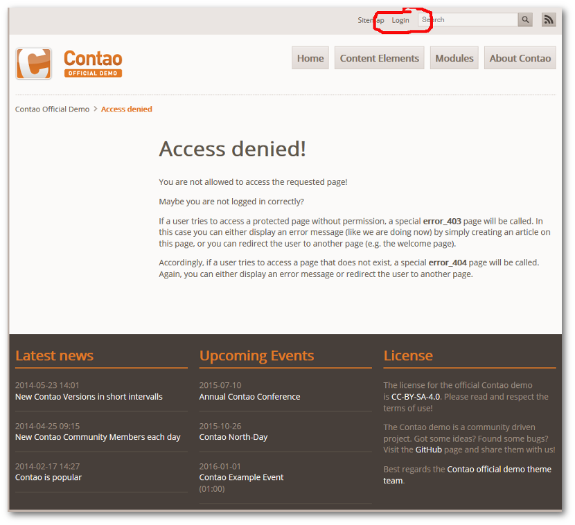

## Ausgabe im Frontend

Wenn Sie als Theme das `Contao Official Demo` installiert und aktiviert haben und dieser Dokumentation gefolgt sind, sollte jetzt im Frontend eine Seite gezeigt werden, die Sie darauf hinweist, dass der Zugriff nicht erlaubt ist.

Und das ist gut so, denn nur dann haben Sie auch wirklich Ihre Seite mit der Ausgabe persönlicher Daten vor einem Zugriff durch Unberechtigte geschützt.

Loggen Sie sich jetzt unter der im Punkt [Vereinsmitglieder anlegen](mitglieder.md) vergebenen Zugangsdaten ein!