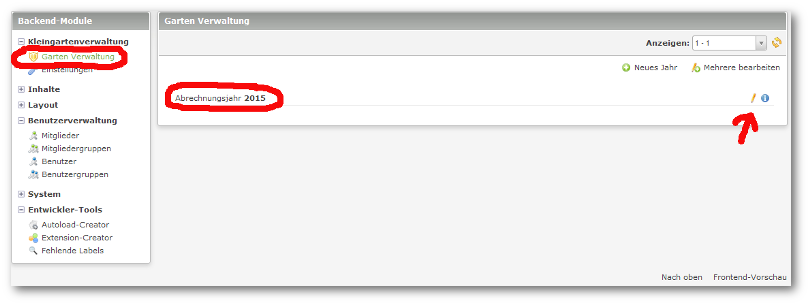
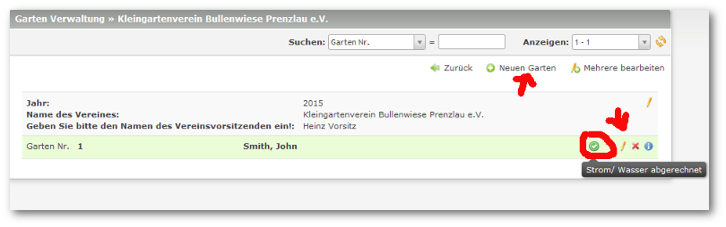

## Anlage eines Garten/ Abrechnung

Zur Anlage eines Garten, bzw. zur Abrechnung wechseln Sie über die Auswahl ``Kleingarten Verwaltung -> Abrechnungsjahr`` in das entsprechende Jahr.

Hier wählen Sie bitte einen bestehenden Garten aus, bzw. legen einen neuen Garten an.

Die Vergabe einer Gartennummer ist mit einer der **wichtigsten** Vorgaben, da diese Nummer nicht mehr gewechselt werden kann. 

**Eine Löschung ist nur im höchsten Abrechnungsjahr möglich!!!**

Hier haben Sie jetzt die Möglichkeit, alle relevanten Daten einzugeben.

Eine kleine Verbrauchstatistik gibt Ihnen einen Vergleich über vergangene Jahre.

Je Garten lassen sich auch individuelle Abrechnungsdaten eingeben, die jeweils nur ein Jahr gelten, oder dauerhaft in den Daten vorgeschrieben werden.

