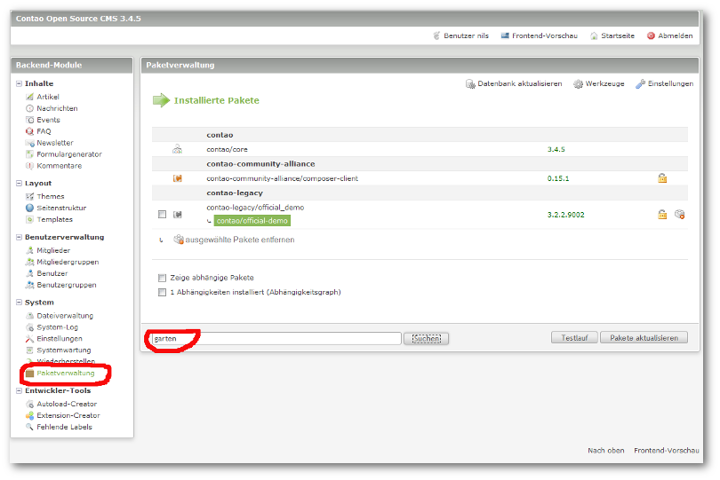
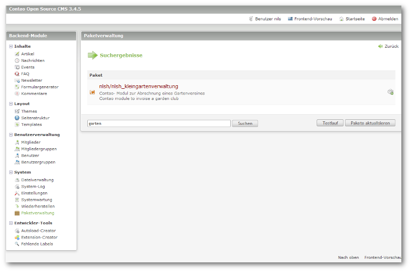
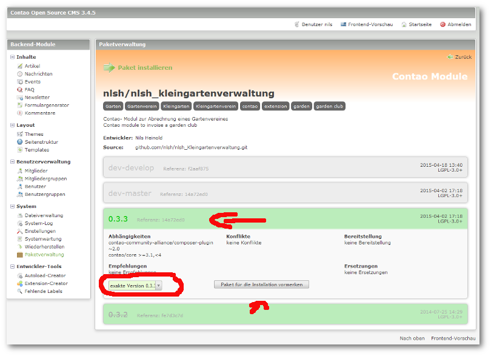
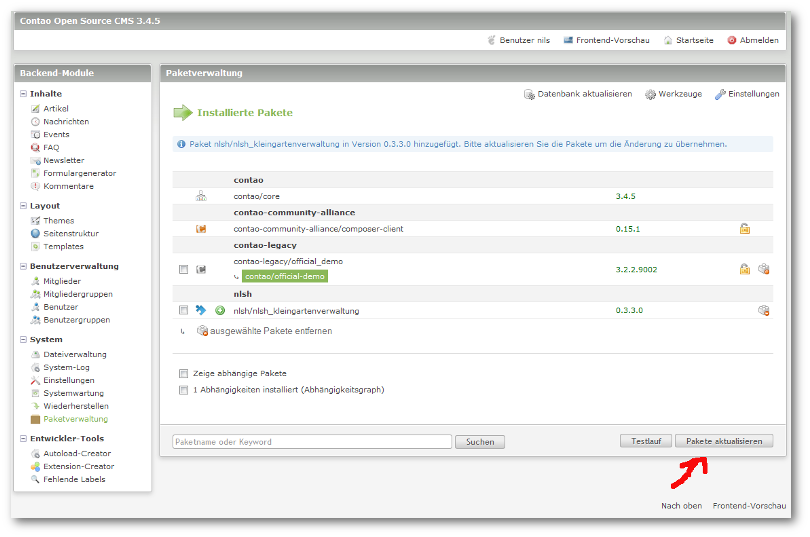
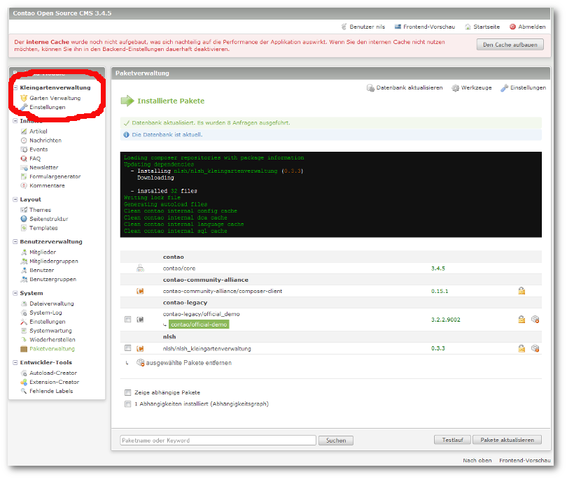

## Installation

Für die Installation, bzw. zur Aktualisierung benötigen Sie [die neue Paketverwaltung für Contao](https://c-c-a.org/ueber-composer).

Suchen Sie dort mit Hilfe des Begriffes `garten`.

Wählen Sie anschließend das Paket `nlsh/nlsh_kleingartenverwaltung` aus.

Benutzen Sie jetzt bitte nur die Höchste, nicht durchgestrichene Release- Version und wählen zur Installation die `exakte Version X.X.X.X` aus.

Alle anderen Versionen bitte nur nach **Aufforderung von mir** installieren, wenn Bugs behoben werden sollen und ich Sie explizit zum Zwecke eines Testes dazu auffordere.

Bestätigen Sie bitte durch Klick auf `Paket für die Installation vormerken` die gewünschte Installation der Erweiterung.

Mit einem Klick auf `Pakete aktualisieren` sollte sich die Erweiterung selbständig installieren.

**Danach unbedingt noch die Datenbank aktualisieren!!!**

Nach einer (hoffentlich) erfolgreichen Installation durch den Composer sollte sich ein neues Menü in Ihrer Contao- Installation zu erkennen geben.  

