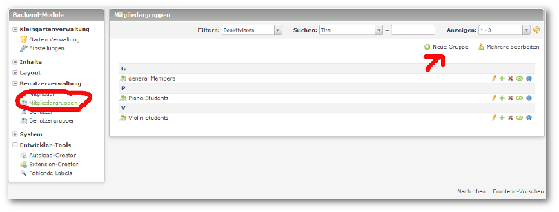
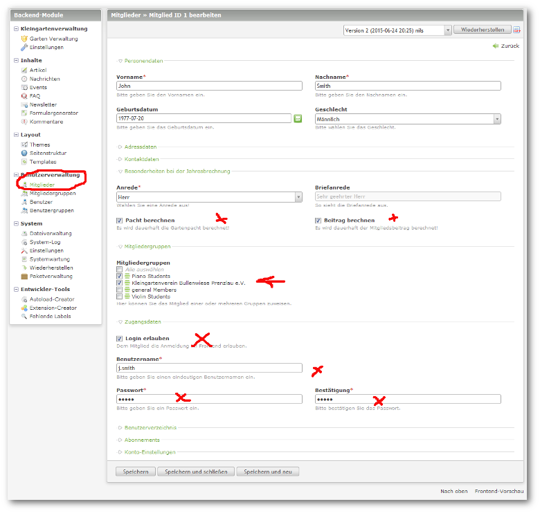

## Mitglieder anlegen

Als Erstes müssen Sie in der Benutzerverwaltung eine Mitgliedergruppe anlegen!

Danach legen Sie die Mitglieder in der Mitgliederverwaltung von Contao an und weisen diese **unbedingt** der o.g. Mitgliedergruppe zu!

Dies ist darum so wichtig, da nur Mitglieder aus dieser Gruppe später für die Belegung der Gärten ausgewählt werden können.

Sie wählen hier die Anrede für den späteren Rechnungstext und haben die Möglichkeit, einige Mitglieder generell von Pacht- oder Beitragszahlungen auszuschließen!

**Achtung!!** Bitte auch die Zugangsdaten vergeben, da Sie ja hoffentlich alle Zugangsmöglichkeiten schützen werden.

