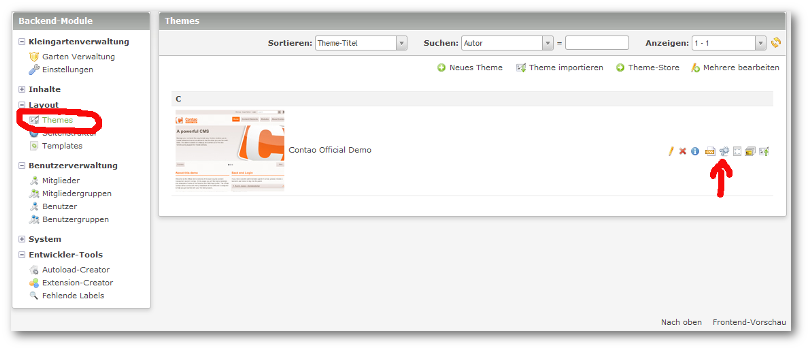
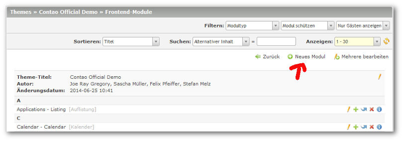
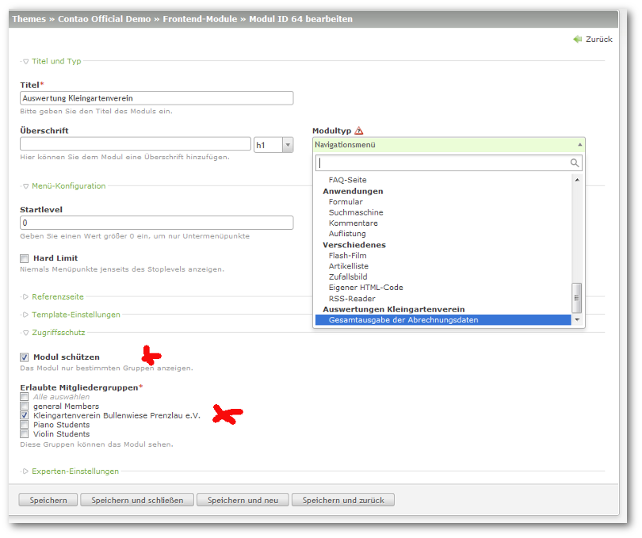

## Modul anlegen

Um im Frontend eine Ausgabe zu Erzeugen, müssen Sie zunächst ein Modul für die Erweiterung anlegen.

Wählen Sie dort das Symbol für ein ``Neues Modul`` erstellen.

Wählen Sie hier bitte den Modultyp ``Auswertungen Kleingartenverein -> Gesamtausgabe der Abrechnungsdaten``.

**Bitte Schützen Sie unbedingt dieses Modul vor unberechtigten Zugriffen!!!**

