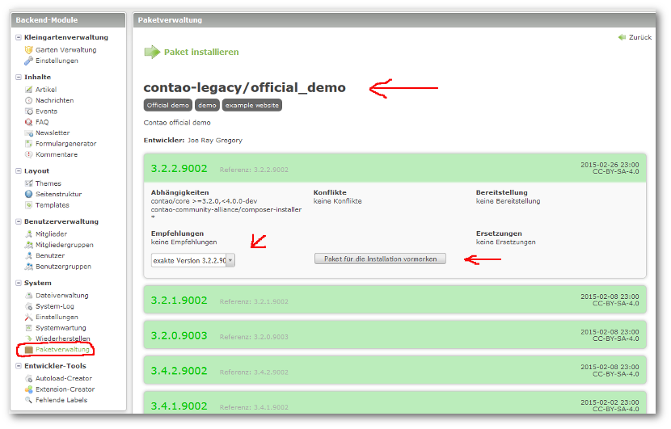
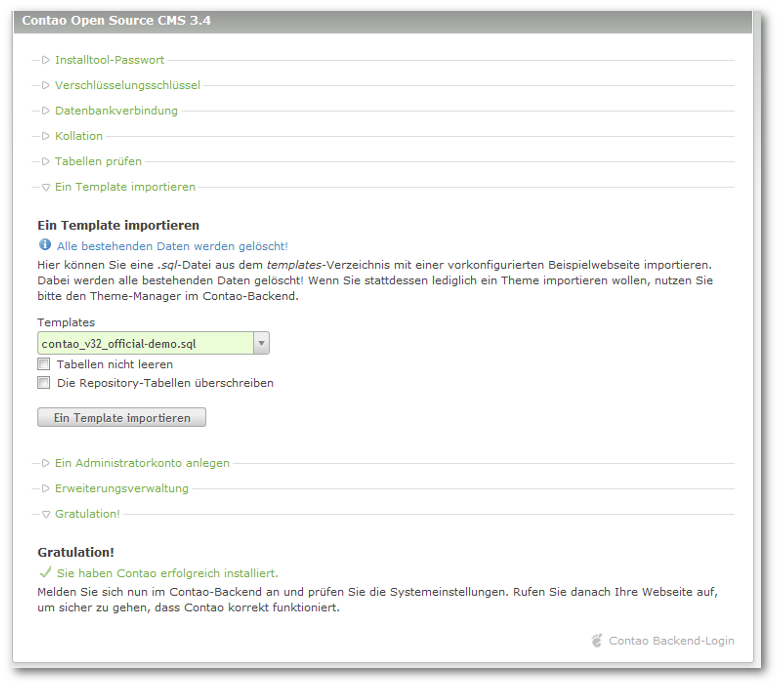
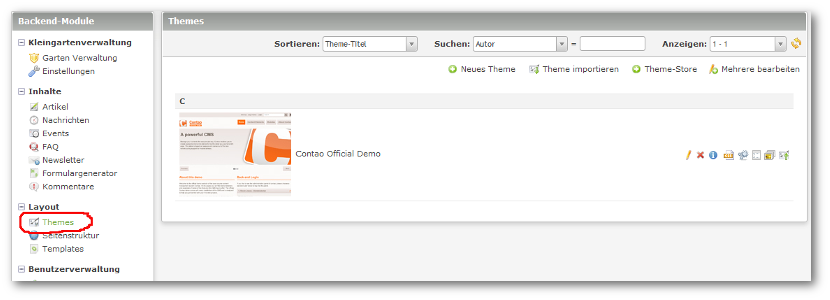

## Template *[Contao Official Demo](http://demo.contao.org/en/ "Contao Official Demo")*

Um gleiche Voraussetzungen für die Nachvollziehbarkeit von Fehlern zu schaffen, benutzt bitte das offizielle Contao- Demo- Themes- Template.

Testet bitte erst dort, ob der Fehler auch hier auftritt und meldet dann diesen unter [https://github.com/nlsh/nlsh_Kleingartenverwaltung/issues](https://github.com/nlsh/nlsh_Kleingartenverwaltung/issues)!!!

Vorbereitet wir die Installation über die Paketverwaltung des Composers. Diese installiert die entsprechende .sql- Datei in das `templates- Verzeichnis` Ihrer Contao- Installation.

Danach die Installation von Contao unter `contao/install.php` aufrufen und das Template importieren.

Loggt euch dann wieder in das Backend ein und unter Themes sollte jetzt das Demo- Theme erscheinen.

