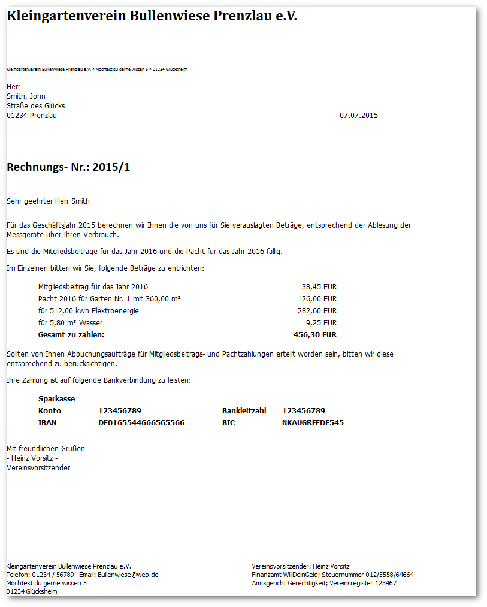

## Rechnungsausgabe

Das Layout der Rechnungsausgabe entspricht einem DIN A4 Blatt und beinhaltet die Ausgabe der im Backend eingegeben Daten für die Abrechnung der einzelnen Gärten, im Zusammenspiel mit den jeweils zum Jahr passend hinterlegten Daten in den Einstellungen zu diesem Jahr.

**Das Layout ist in einem Template hinterlegt und kann natürlich den eigenen Bedürfnissen angepasst werden!!!**

**Bitte bei Druckproblemen auch die Einstellungen Ihres Browsers hinsichtlich der Größe der Ränder usw. beachten!**

