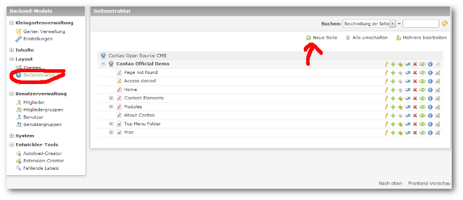
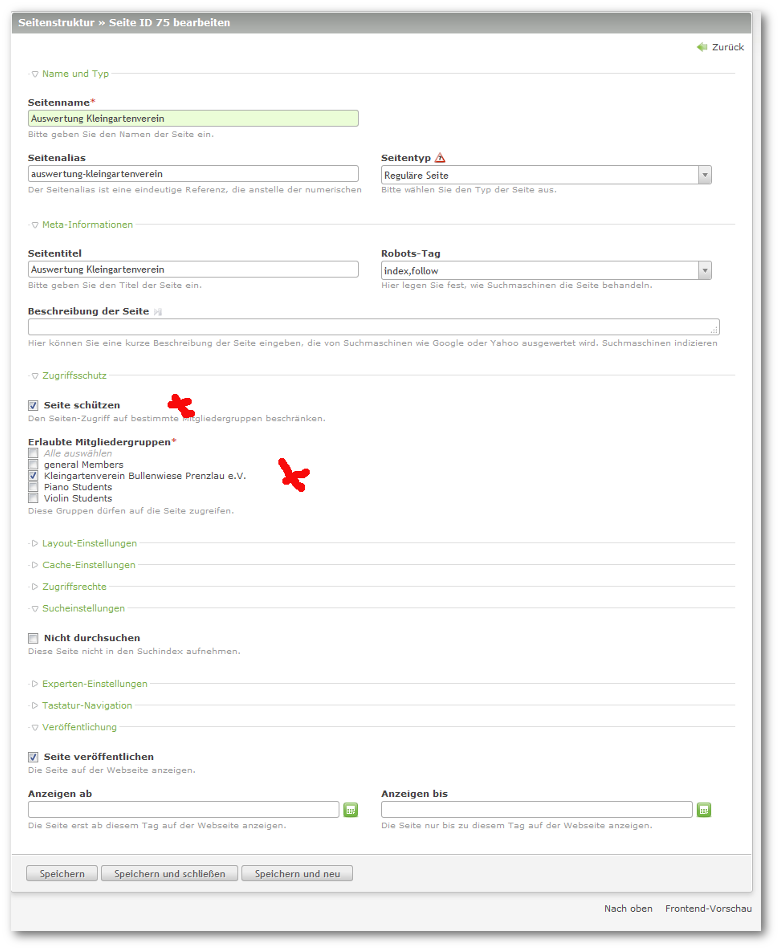
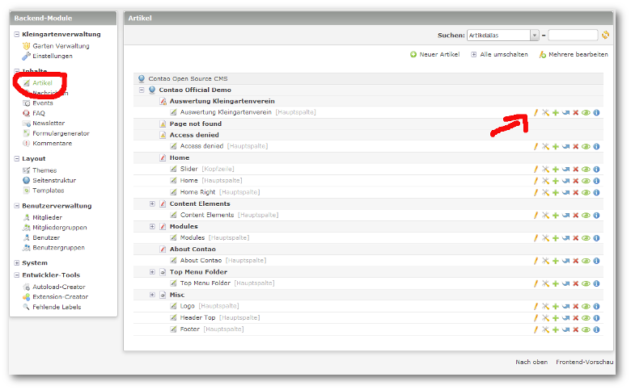
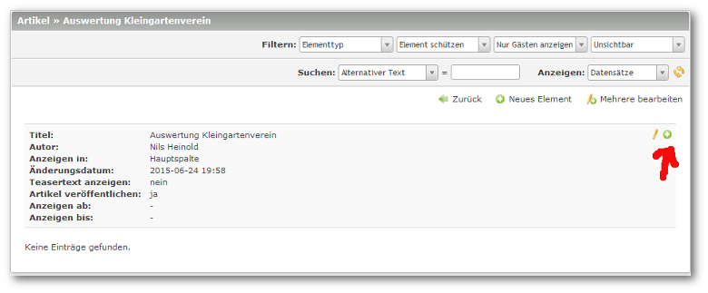
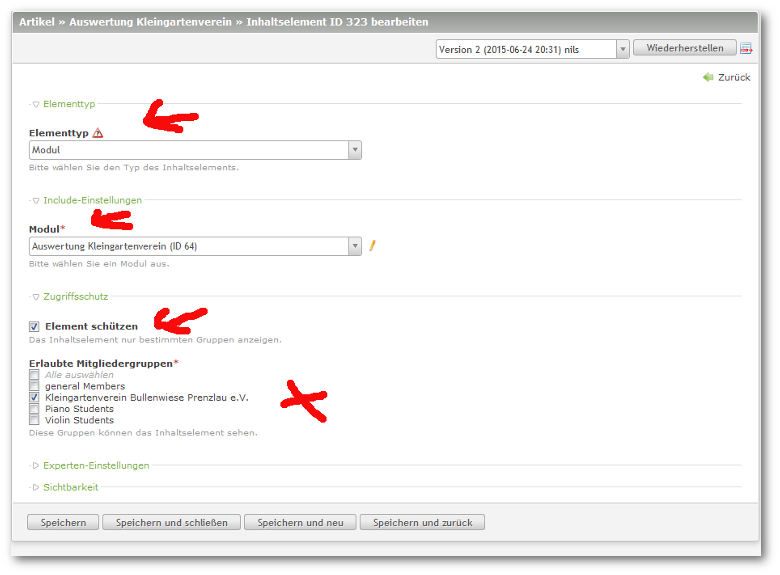

## Modul in Seite integrieren

Um das Modul in Ihrer Web- Site zu integrieren, müssen Sie eine neue Seite anlegen.

**Bitte auch hier wieder die Seite schützen!!!**

Danach unter `Inhalte -> Artikel` den Bearbeitungs- Stift drücken und einen neuen Artikel hinzufügen.

Dort jeztz ein neues Element erstellen.

Das Elementtyp auf `Modul` stellen.

Wählen Sie dann Ihr eigens erstelltes Modul für die Auswertung an.

**Und schützen Sie wiederum Ihr Modul!!!**

