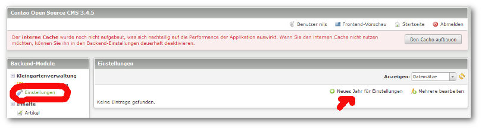
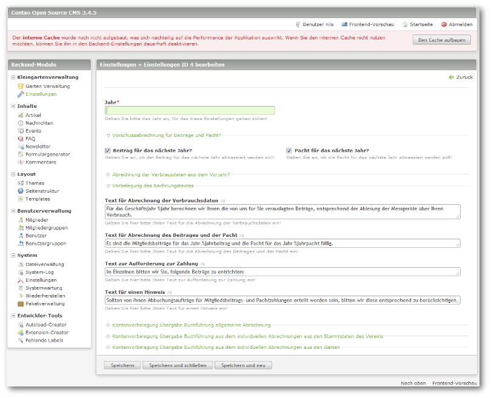

## Einstellungen

Die Einstellungen sind jahresspezifisch und können auch nicht vorgetragen werden.

Die Einstellungen beinhalten die Vorgaben zur Rechnungslegung und der Übergabe der Daten an ein Rechnungswesen- Programm.

Die Daten werden im DATEV- Postversand- Format ausgegeben, da eigentlich alle Programme diese Daten einlesen können.

Sollte beides nicht benötigt werden, müssen keine Datensätze angelegt werden.

Um ein neues Jahr anzulegen, wechseln Sie bitte in die Einstellungen der Erweiterung und legen ein neues Jahr an.

Die Daten der Einstellungen sind schon etwas vorbelegt. 

Die Philosophie dahinter ist die, dass man die Verbrauchsabrechnungen erst am Ende des Jahres erstellen kann (beachte Finanzamt: 
keine Verluste im wirtschaftlichen Bereich!!!), wenn die entsprechenden Jahresabrechnungen der Wasser- und Elektrizitätswerke vorliegen, die Zählerstände der einzelnen Gärten bekannt sind und wir die Gesamtkosten des Jahres kennen. 

Aus diesem Grund sind die Haken bei der Abrechnung der Verbrauchsdaten aus dem Vorjahr nicht gesetzt. Da man aber so diese Ausgaben vorfinanziert, kassieren wir die Beiträge und Pachten ( relativ konstante Einnahmen) schon für das Folgejahr, entsprechende Haken sind schon gesetzt.

Die Texte für die Rechnungslegung sind schon vordefiniert, können aber geändert werden. Die Vorbelegung erfolgt immer bei einem Leereintrag, da dies Pflichtfelder sind. Zu beachten sind hierbei drei Platzhalter.

<table>
	<tr>
		<td> %jahr </td>
		<td> Jahr, für das die Verbrauchsdatenabrechnung erfolgt </td>
	</tr>
	<tr>
		<td> %jahrbeitrag </td>
		<td> Jahr, für das der Beitrag kassiert wird </td>
	</tr>
	<tr>
		<td> %jahrpacht </td>
		<td> Jahr, für das die Pacht kassiert wird</td>
	</tr>
</table>

Danach können noch die in der Finanzbuchhaltung zu nutzenden Konten eingegeben werden.

  