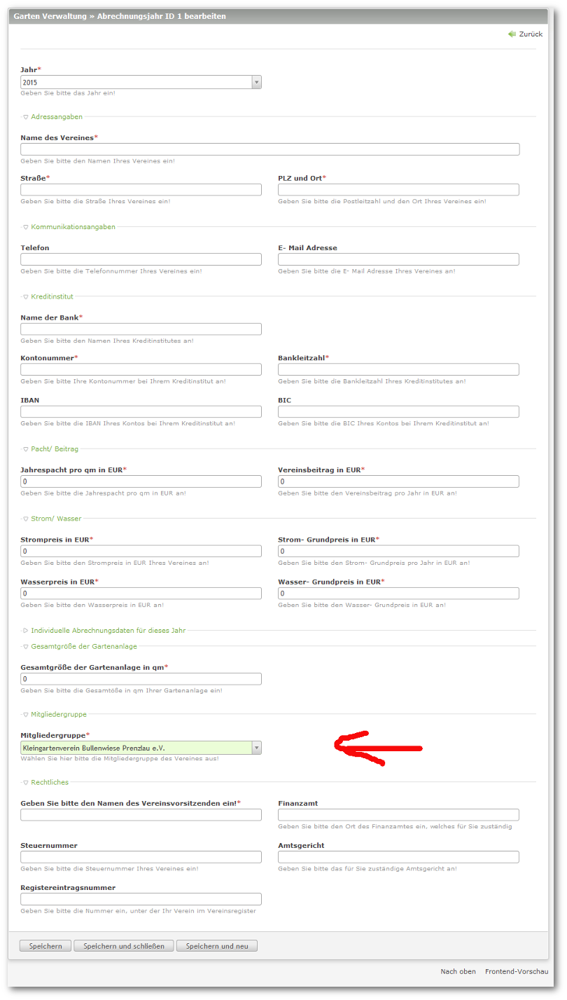

## Stammdaten des Gartenvereines

Als Nächstes erfassen Sie die Stammdaten des Vereines.

Dazu gehen Sie in die ```Kleingartenverwaltung -> Garten Verwaltung``` und legen ein neues Abrechnungsjahr an.


Beim ersten Anlegen von Stammdaten hat man noch die Wahl des Startjahres, nach Eingabe und Speicherung kann man nur noch ein Jahr weiter springen, dabei werden die Daten des Vorjahres vorgetragen.

Viele Felder sind Pflichtfelder, da sie für spätere Auswertungen benötigt werden.

Achten Sie auch bitte auf die korrekte Auswahl der Mitgliedergruppe!



Die Erläuterungen zu den einzelnen Eingaben sollten selbsterklärend sein.
