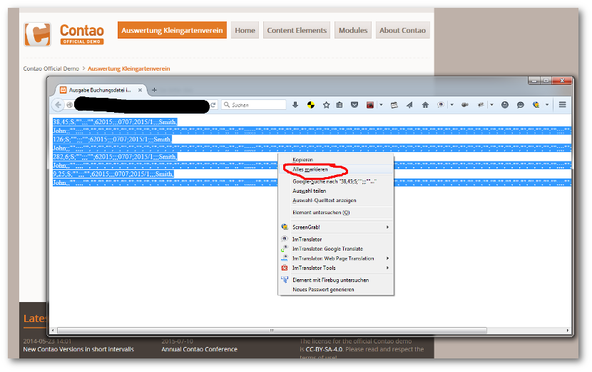

## Übergabe Finanzbuchhaltung

Nach einem Klick auf den Button `Gesamt`, öffnet sich ein Browser- Fenster mit den Postversanddaten im DATEV- Format, zum Export in ein Finanzbuchhaltungsprogramm.

Diese Daten dann in einem Text- Editor Ihrer Wahl einfügen -> speichern -> und in Ihrem Finanzbuchhaltungsprogramm einlesen.

**Wichtig!!**

Die Rechnungsnummer ist eine *Addition* aus `Abrechnungsjahr`, `/` und `Gartennummer`!

Das Rechnungsdatum ist das Druckdatum!

Die Debitoren- Nummer ist immer `6` zzgl. dem Jahr (z.B. für das Jahr 2015 -> 62015)!

Das Text- Feld ist immer der Name des Gartenbesitzers!!!

Viel Spaß!

 