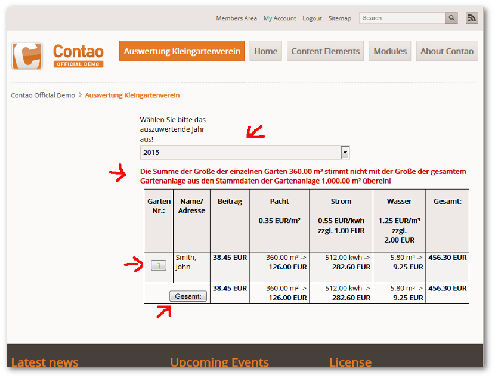

## Auswertung der Abrechnungsdaten

Nach dem folgen des Links `Auswertung Kleingartenverein` wird Ihnen eine Zusammenfassung der Auswertung, der im Backend eingegeben Daten, ausgegeben.

Sie haben hier die Möglichkeit, in ein zurückliegendes Jahr zu wechseln.

Außerdem wird eine Fehlermeldung ausgegeben, falls die Summe der einzelnen Gärten nicht mit der Gesamtfläche der Gartenanlage übereinstimmt, um Pacht- Abrechnungen *fehlerfreier* erstellen zu können.

Mit einem Klick auf dem Button der `Garten- Nr.:` öffnet sich ein weiteres Browser- Fenster mit der Rechnung zum zugehörigen Garten.

Mit einem Klick auf dem Button `Gesamt` gelangen Sie in ein Browser- Fenster mit der Ausgabe der Daten für ein Finanzbuchhaltungsprogramm, welches Fibu- Daten im DATEV- Standardversand verarbeiten kann.

